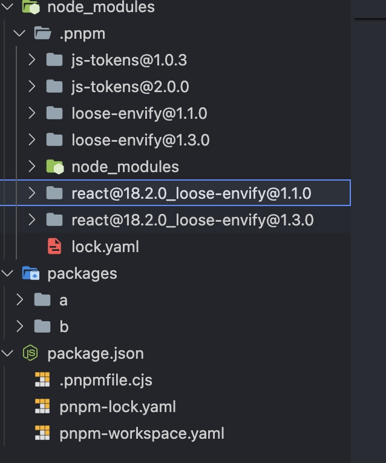

# pnpm-peer-trick

```js
// before
react
  dependencies
  - loose-envify   <---- How can I specify the version of this? peer it
      dependencies
      - js-tokens

// modified by .pnpmfile.cjs
react
  peerDependencies
  - loose-envify
      dependencies
      - js-tokens
```

```js
a > react@18.2.0 > loose-envify@1.1.0
b > react@18.2.0 > loose-envify@1.3.0
```



```js
app-demo
  react@18.2.0     <----------- the same
  antd                        |
    peerDependencies          |
    - react@18.2.0 <----------- 
```


btw, I think react is the best package to test pnpm behavior
```js
react > loose-envify > js-tokens
```
